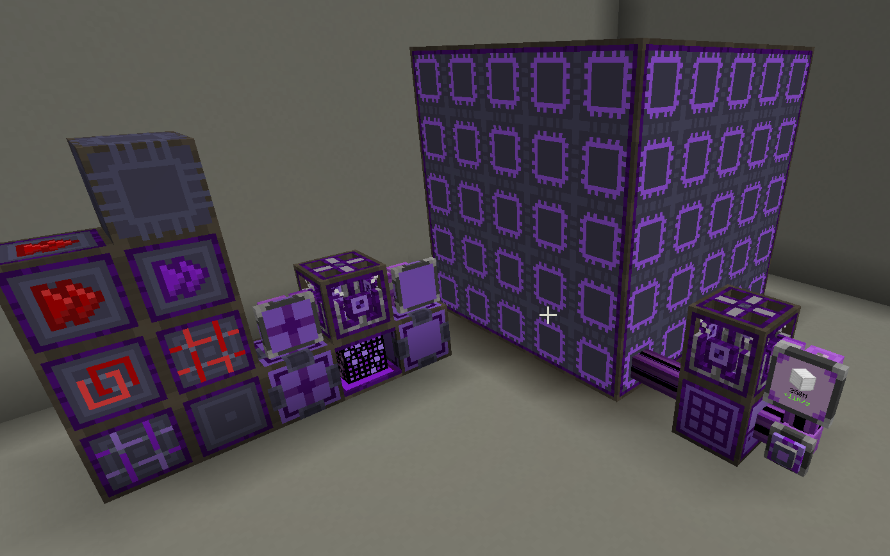

---
navigation:
  title: 高级AE索引/目录
  position: 70
---

# 高级AE！

高级AE专注于提升您在操作ME系统时的用户体验，并扩展终局系统的可能性。本模组允许您升级样板供应器，使其能够将物品推送到目标机器的特定面，并创建可运行无限量合成任务的多方块量子计算机（在剩余合成存储空间的情况下共享并行处理单元），同时还包含大量其他生活质量改进功能！

完整提供的方块与物品列表，请查阅以下指南页面：

## 高级设备

<CategoryIndex category="advanced devices"></CategoryIndex>

## 高级物品

<CategoryIndex category="advanced items"></CategoryIndex>

发现问题？缺少功能？
请在此处提交：
[高级AE GitHub](https://github.com/pedroksl/AdvancedAE)

翻译有问题？
[请点击此处提交反馈](https://github.com/NsATHUV/AE2-1.20.1-Guide-zh_CN/issues/new?template=%E7%BF%BB%E8%AF%91%E6%8C%87%E6%AD%A3.md)