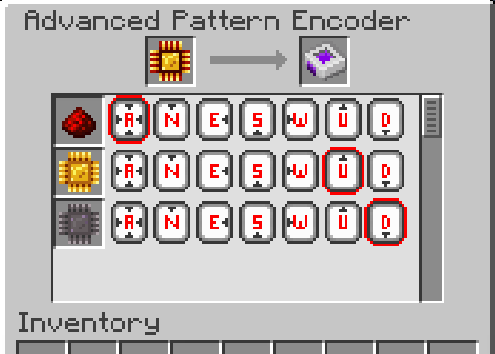

---
navigation:
  parent: aae_intro/aae_intro-index.md
  title: 高级样板编码器
  icon: advanced_ae:adv_pattern_encoder
categories:
  - advanced items
item_ids:
  - advanced_ae:adv_pattern_encoder
  - advanced_ae:adv_processing_pattern
---

# 高级样板编码器

为了让ME高级样板供应器知晓物品的输送方向，需要使用特殊设备对方向信息进行编码。手持该设备右键点击可打开其配置界面。

<ItemImage id="advanced_ae:adv_pattern_encoder" scale="4"></ItemImage>

已编码的<ItemLink id="advanced_ae:adv_processing_pattern" />可放入左侧槽位进行解码，解码后所有原料将显示在列表中。

每行配置项包含一组代表所有可能输送方向的按钮。选择"A"按钮表示将原料输送至与样板供应器直接连接的方块面，选择特定方向按钮将强制从指定面插入物品。需注意：
- 高级样板仅能被<ItemLink id="advanced_ae:small_adv_pattern_provider" />或<ItemLink id="advanced_ae:adv_pattern_provider" />正确解码
- 若用于其他类型的样板供应器，其行为将与普通样板一致
- 若指定面无法插入单个物品，则不会执行定向输送，转而采用标准样板供应器行为