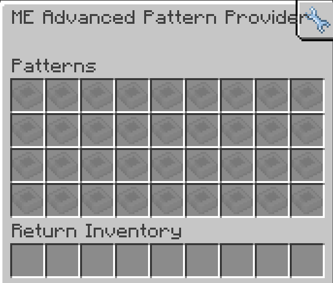

---
navigation:
  parent: aae_intro/aae_intro-index.md
  title: ME高级样板供应器
  icon: advanced_ae:adv_pattern_provider
categories:
  - advanced devices
item_ids:
  - advanced_ae:adv_pattern_provider
  - advanced_ae:small_adv_pattern_provider
  - advanced_ae:adv_pattern_provider_part
  - advanced_ae:small_adv_pattern_provider_part
---

# ME高级样板供应器

<Row gap="20">
<BlockImage id="advanced_ae:adv_pattern_provider" scale="8"></BlockImage>
<BlockImage id="advanced_ae:adv_pattern_provider" p:push_direction="up" scale="8"></BlockImage>
<GameScene zoom="8" background="transparent">
  <ImportStructure src="../structure/cable_app_part.snbt"></ImportStructure>
</GameScene>
</Row>

ME高级样板供应器是<ItemLink id="ae2:pattern_provider" />的升级版本，可将普通样板供应器或<ItemLink id="expatternprovider:ex_pattern_provider" />
升级为能够配置样板中每个物品的输送方向。这项强大的功能使得单方块自动化机械成为可能——无需管道即可实现特定面输入特定原料！

*说的就是你，机械动力。*

要使用此功能，需要将经<ItemLink id="advanced_ae:adv_pattern_encoder" />编码后的<ItemLink id="advanced_ae:adv_processing_pattern" />放入供应器。