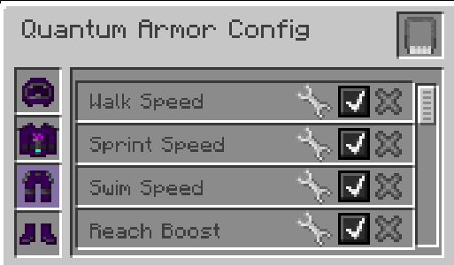

---
navigation:
  parent: aae_intro/aae_intro-index.md
  title: 量子装甲套装
  icon: advanced_ae:quantum_helmet
categories:
  - advanced items
item_ids:
  - advanced_ae:quantum_helmet
  - advanced_ae:quantum_chestplate
  - advanced_ae:quantum_leggings
  - advanced_ae:quantum_boots
  - advanced_ae:quantum_upgrade_base
  - advanced_ae:walk_speed_card
  - advanced_ae:sprint_speed_card
  - advanced_ae:step_assist_card
  - advanced_ae:jump_height_card
  - advanced_ae:lava_immunity_card
  - advanced_ae:flight_card
  - advanced_ae:water_breathing_card
  - advanced_ae:auto_feeding_card
  - advanced_ae:auto_stock_card
  - advanced_ae:magnet_card
  - advanced_ae:hp_buffer_card
  - advanced_ae:evasion_card
  - advanced_ae:regeneration_card
  - advanced_ae:strength_card
  - advanced_ae:attack_speed_card
  - advanced_ae:luck_card
  - advanced_ae:reach_card
  - advanced_ae:swim_speed_card
  - advanced_ae:night_vision_card
  - advanced_ae:flight_drift_card
  - advanced_ae:recharging_card
  - advanced_ae:portable_workbench_card
  - advanced_ae:pick_craft_card
---

# 量子装甲套装

<Row gap="10">
<ItemImage id="advanced_ae:quantum_helmet" scale="4"></ItemImage>
<ItemImage id="advanced_ae:quantum_chestplate" scale="4"></ItemImage>
<ItemImage id="advanced_ae:quantum_leggings" scale="4"></ItemImage>
<ItemImage id="advanced_ae:quantum_boots" scale="4"></ItemImage>
</Row>

* <ItemLink id="advanced_ae:quantum_helmet" />
* <ItemLink id="advanced_ae:quantum_chestplate" />
* <ItemLink id="advanced_ae:quantum_leggings" />
* <ItemLink id="advanced_ae:quantum_boots" />

是否想过将ME网络穿在身上？现在无需再想象！量子装甲套装是与AE2系统连接的高科技隐形装备，可在移动中便捷访问所有资源！默认情况下，这是一套能量驱动的护甲，防御力堪比下界合金装备。它能利用能量缓冲生成护盾，吸收大量伤害。战靴可免疫坠落伤害，胸甲可消除飞行状态下的挖掘惩罚。但只有安装升级卡后，才能真正发挥其威力！

 

## 绑定装甲

将护甲部件放入<ItemLink id="ae2:wireless_access_point" />的对应槽位即可单独绑定至系统。不同护甲部件和已安装的升级卡会解锁不同功能。注意：需处于无线访问点的信号范围内才能正常使用额外功能。

 

## 安装升级

安装升级需先穿戴护甲部件，然后按下热键（默认为N键）打开量子装甲配置界面。

在此界面可添加/移除升级卡，启用/禁用功能，并对支持配置的升级进行参数设置。

 

## 量子升级基础卡

<ItemImage id="advanced_ae:quantum_upgrade_base" scale="2"></ItemImage>

<ItemLink id="advanced_ae:quantum_upgrade_base" />本身无特殊功能，但用于合成所有升级卡。

 

## 自动喂食卡

<ItemImage id="advanced_ae:auto_feeding_card" scale="2"></ItemImage>

<ItemLink id="advanced_ae:auto_feeding_card" />允许设置特定物品用于自动喂食。将所需物品拖入过滤槽后，若装备已连接至ME网络，系统会在饥饿时自动从网络中调取对应食物。

 

## 自动补货卡

<ItemImage id="advanced_ae:auto_stock_card" scale="2"></ItemImage>

<ItemLink id="advanced_ae:auto_stock_card" />需装备连接至ME网络且处于访问点信号范围内。可配置若干物品堆叠量，始终在背包中保持指定数量。单物品可跨多个槽位存放。

 

## 速度卡组

<Row gap="10">
<ItemImage id="advanced_ae:walk_speed_card" scale="2"></ItemImage>
<ItemImage id="advanced_ae:sprint_speed_card" scale="2"></ItemImage>
<ItemImage id="advanced_ae:swim_speed_card" scale="2"></ItemImage>
</Row>

* <ItemLink id="advanced_ae:walk_speed_card" />
* <ItemLink id="advanced_ae:sprint_speed_card" />
* <ItemLink id="advanced_ae:swim_speed_card" />

这些升级卡可提升穿戴者的移动速度。均支持速度值配置，潜行/飞行时同样生效。注意：也可用于降低速度以增强其他加速效果下的操控性。

 

## 高度卡组

<Row gap="10">
<ItemImage id="advanced_ae:jump_height_card" scale="2"></ItemImage>
<ItemImage id="advanced_ae:step_assist_card" scale="2"></ItemImage>
</Row>

* <ItemLink id="advanced_ae:jump_height_card" />
* <ItemLink id="advanced_ae:step_assist_card" />

改变垂直运动能力：可配置跳跃高度提升或启用自动跨步。

 

## 飞行卡组

<Row gap="10">
<ItemImage id="advanced_ae:flight_card" scale="2"></ItemImage>
<ItemImage id="advanced_ae:flight_drift_card" scale="2"></ItemImage>
</Row>

### 飞行卡

<ItemLink id="advanced_ae:flight_card" />启用创造模式飞行。飞行速度可通过界面滑块调节，且与移动/疾跑速度卡叠加生效。

### 飞行惯性卡

<ItemLink id="advanced_ae:flight_drift_card" />需配合飞行卡使用。新增惯性调节滑块：值越低停止越快，设为0时立即停止。

 

## ME无线充电卡

<ItemImage id="advanced_ae:recharging_card" scale="2"></ItemImage>

<ItemLink id="advanced_ae:recharging_card" />启用装备无线充电功能。需连接网络且处于访问点范围内。胸甲安装此卡时，可额外为物品栏（除副手）和饰品栏充电。

 

## 便携式工作台卡

<ItemImage id="advanced_ae:portable_workbench_card" scale="2"></ItemImage>

<ItemLink id="advanced_ae:portable_workbench_card" />为量子装甲添加便携式元件工作台。按配置热键打开，功能与方块形态一致。

 

## Pick-Craft功能卡

<ItemImage id="advanced_ae:pick_craft_card" scale="2"></ItemImage>

<ItemLink id="advanced_ae:pick_craft_card" />为装甲新增热键功能：按下后尝试合成玩家当前指向的方块。需满足网络连接和目标方块对应样板存在。弹出数量选择窗口后，流程与常规自动合成请求相同。

 

## 功能卡组

<Row gap="10">
<ItemImage id="advanced_ae:night_vision_card" scale="2"></ItemImage>
<ItemImage id="advanced_ae:lava_immunity_card" scale="2"></ItemImage>
<ItemImage id="advanced_ae:water_breathing_card" scale="2"></ItemImage>
<ItemImage id="advanced_ae:magnet_card" scale="2"></ItemImage>
</Row>

* <ItemLink id="advanced_ae:night_vision_card" />
* <ItemLink id="advanced_ae:lava_immunity_card" />
* <ItemLink id="advanced_ae:water_breathing_card" />
* <ItemLink id="advanced_ae:magnet_card" />

提供多样化功能：免疫特定伤害、夜视能力。磁卡支持配置拾取过滤规则和范围设置。

 

## 防御卡组

<Row gap="10">
<ItemImage id="advanced_ae:hp_buffer_card" scale="2"></ItemImage>
<ItemImage id="advanced_ae:regeneration_card" scale="2"></ItemImage>
<ItemImage id="advanced_ae:evasion_card" scale="2"></ItemImage>
</Row>

* <ItemLink id="advanced_ae:hp_buffer_card" />
* <ItemLink id="advanced_ae:regeneration_card" />
* <ItemLink id="advanced_ae:evasion_card" />

提供多样化防御增益：提升生命上限、加速生命恢复、概率免疫所有伤害。

 

## 攻击卡组

<Row gap="10">
<ItemImage id="advanced_ae:strength_card" scale="2"></ItemImage>
<ItemImage id="advanced_ae:attack_speed_card" scale="2"></ItemImage>
</Row>

* <ItemLink id="advanced_ae:strength_card" />
* <ItemLink id="advanced_ae:attack_speed_card" />

增强攻击能力：提升攻击伤害和攻击速度。

 

## 属性卡组

<Row gap="10">
<ItemImage id="advanced_ae:luck_card" scale="2"></ItemImage>
<ItemImage id="advanced_ae:reach_card" scale="2"></ItemImage>
</Row>

* <ItemLink id="advanced_ae:luck_card" />
* <ItemLink id="advanced_ae:reach_card" />

提供属性增益：提升战利品幸运值、可配置方块触碰距离。

 

## 未来计划

本套装已包含基础功能，更多特性正在开发中，敬请期待！