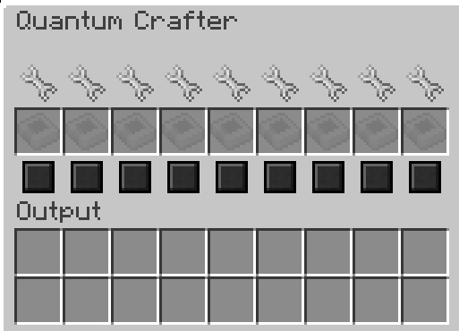
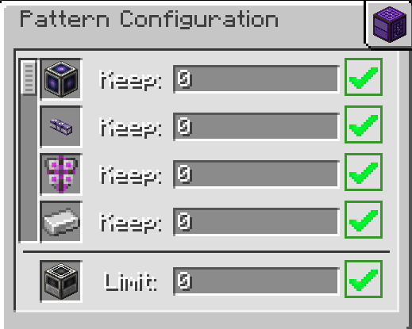

---
navigation:
  parent: aae_intro/aae_intro-index.md
  title: 量子合成器
  icon: advanced_ae:quantum_crafter
categories:
  - advanced devices
item_ids:
  - advanced_ae:quantum_crafter
---

# 量子合成器

<BlockImage id="advanced_ae:quantum_crafter" p:working="true" scale="4"></BlockImage>

量子合成器是功能强大且可配置的自动合成设备。它能调用整个ME系统的存储资源，实现不间断的自动化合成任务。该设备能够以极快的速度执行合成流程，并确保关键资源永不枯竭。同时支持流体替换合成和递归合成（即输出物作为输入参与合成）。

## 使用说明

将量子合成器接入ME网络并连接线缆即可使用，需占用1个频道。选择需要持续运行的配方并编码为合成样板，将样板置入设备对应的槽位。

插入样板后，可通过两个按钮进行配置：
- 底部方形按钮：启用/停用该样板
- 齿轮按钮：打开样板配置界面（即使样板已启用，仍需满足特定条件才会执行合成）

在配置界面中：
1. 列出所有原料和主产物
2. 数字输入框可设置：
   - 原料最低保有量（支持数学表达式如`3 * 4`）
   - 产物最大合成量（输入0则取消限制）
3. 右侧状态标识显示数值是否生效

## 输出配置

默认将产物直接注入ME系统，通过左侧工具栏的单元格按钮可切换为向相邻容器自动导出。启用导出功能后，可进一步配置允许导出的方向面。

## 升级支持

安装升级卡可解锁完整功能：
- <ItemLink id="ae2:speed_card" />：提升合成速度（最高每刻执行64次合成）
- <ItemLink id="ae2:redstone_card" />：启用红石控制

注意事项：
- 递归合成时需注意逻辑闭环
- 流体替换需在样板中启用对应选项
- 建议搭配大容量能源元件使用