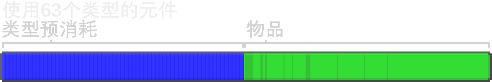

---
navigation:
  parent: ae2-mechanics/ae2-mechanics-index.md
  title: 字节与类型
  icon: creative_item_cell
---

# 字节与类型

<Row>
    <ItemImage id="item_storage_cell_1k" scale="4" />
    <ItemImage id="item_storage_cell_4k" scale="4" />
    <ItemImage id="item_storage_cell_16k" scale="4" />
    <ItemImage id="item_storage_cell_64k" scale="4" />
    <ItemImage id="item_storage_cell_256k" scale="4" />
  </Row>

[存储元件](../items-blocks-machines/storage_cells.md)的容量由**字节数**和**种类数**一同决定。字节数和现实中的电脑中一样，是对存储元件中总物品量的度量。
种类数则是对元件中有多少种不同物品，或者说**种类**的度量。每个种类代表一种物品，因此4,096个圆石是1种而16把带有不同附魔的剑是16种。

每种存储元件所能够存储的数据量是一定的。每个种类都会预先占用一定量的字节数(数值随元件大小变化)，而每个物品会占用1比特，
换言之8个物品会占用1字节而1组物品(64个)会占用8字节，该占用量与物品本身的堆叠上限无关，例如，64个鞍与64个石头占用的字节数相同。

总之，每个物品占1比特，8个物品占1字节。对于流体元件来说，8桶流体占1字节。

许多人对元件的种类数限制颇有微词，但是这是**必要的限制**。存储元件用自身的NBT标签存储数据，这样更稳定。
然而，这也就意味着在一个元件中存储过多数据会导致服务端单次向玩家发包过大，造成与原版“禁人书”相同的效果。
此外，系统内物品种类过多会加大整理与物品处理负载。不过对种类的限制其实并不是很严格。
一台装满元件的<ItemLink id="drive" />可提供630的种类数，只要你不存储大量的不可堆叠物品其实已经够用了。

- 译者注：Minecraft的客户端只能接受不超过2 MiB的服务端数据包。超过该限制将会导致连接被强制断开。
- “禁人书”通过制造NBT极大的成书并在容器内大量放置，使得数据包达到此上限，进而踢出玩家，而玩家下次上线后又会因相同原因被踢出，从而达到封禁效果。
- 与此相关的是，Minecraft每个区块的文件大小也是有上限的。由于元件被放入终端或箱子后其NBT也会存储在区块文件中，过大的NBT可能会造成坏档。
- 此处内容来源于[nhdsd](https://github.com/nhdsd/AE2-Chinese-Guidebook)，由[NsATHUV](https://github.com/NsATHUV)修正。

由于上述原因，种类数存在的意义是“坚决阻止”你把刷怪塔中各种损坏程度不尽相同的盔甲和工具丢进ME系统。
只要耐久度或附魔不同，它们就会被分开存储，这会使得系统臃肿不堪。建议你在物品进入你的系统前将它们分离出来。 

直奔最高级的存储元件一般不是个好主意，因为你用了更多资源却没有得到额外的种类数。这意味着即使在游戏后期，各种大小的存储元件都还是有用的，这是一种折衷。

下表对比了不同等级的存储元件的存储能力及造价的粗略估计值。

## 存储元件：容量 vs 造价

| 元件                                     | 字节数   | 种类数 | 每种类字节数  | 赛特斯石英消耗 | 红石消耗  | 金锭消耗 | 荧石粉消耗 |
| ---------------------------------------- | ------: | ----: | -----------: | ------------: | -------: | -------: | --------: |
| <ItemLink id="item_storage_cell_1k" />   |   1,024 |    63 |            8 |             4 |        5 |        1 |         0 |
| <ItemLink id="item_storage_cell_4k" />   |   4,096 |    63 |           32 |         14.25 |       20 |        3 |         0 |
| <ItemLink id="item_storage_cell_16k" />  |  16,384 |    63 |          128 |            45 |       61 |        9 |         4 |
| <ItemLink id="item_storage_cell_64k" />  |  65,536 |    63 |          512 |        137.25 |      184 |       27 |        16 |
| <ItemLink id="item_storage_cell_256k" /> | 262,144 |    63 |         2048 |           414 |      553 |       81 |        48 |

## 存储种类数变化对容量的影响

种类预先占用的字节数会使得仅仅只存储1种类物品的元件能够存储的物品量几乎是存储了63种类物品的元件的2倍。

| 元件                                     | 使用1种类数时的容量 | 使用63种类数时的容量 |
| ---------------------------------------- | ----------------: | -----------------: |
| <ItemLink id="item_storage_cell_1k" />   |             8,128 |              4,160 |
| <ItemLink id="item_storage_cell_4k" />   |            32,512 |             16,640 |
| <ItemLink id="item_storage_cell_16k" />  |           130,048 |             66,560 |
| <ItemLink id="item_storage_cell_64k" />  |           520,192 |            266,240 |
| <ItemLink id="item_storage_cell_256k" /> |         2,080,768 |          1,064,960 |

- 译者注：每种类预先占用元件总字节数的1/128。
- 此处内容来源于[nhdsd](https://github.com/nhdsd/AE2-Chinese-Guidebook)，由[NsATHUV](https://github.com/NsATHUV)修正。

- 汉化图来源于Github [Minecraft-Mod-Language-Package](https://github.com/CFPAOrg/Minecraft-Mod-Language-Package/tree/main/projects/1.20/assets/applied-energistics-2/ae2/ae2guide/assets/diagrams)。