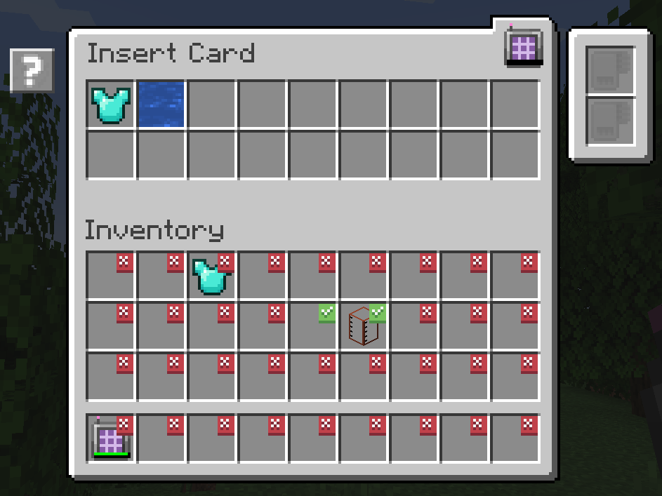
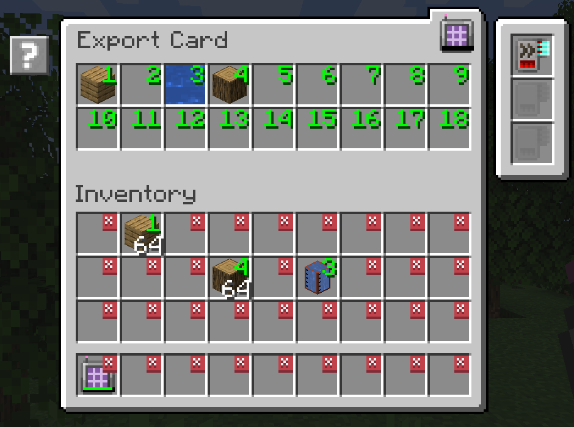

---
navigation:
  title: "附加模组：AE2 输入输出卡"
  icon: ae2insertexportcard:export_card
  position: 150
categories:
  - tools
item_ids:
- ae2insertexportcard:export_card
- ae2insertexportcard:insert_card
---

# AE2 输入输出卡

<Row>
  <ItemImage id="ae2insertexportcard:export_card" scale="2" />

  <ItemImage id="ae2insertexportcard:insert_card" scale="2" />
</Row>

输入卡与输出卡可使您将物品从背包与ME系统间进行导入/导出操作

## 输入卡

<ItemImage id="ae2insertexportcard:insert_card" scale="2" />

输入卡可将您背包中特定槽位的物品批量导入ME系统

点击槽位添加勾选标记，所有被标记槽位中的物品将被自动导入ME系统。通过拖拽物品至顶部区域可设置过滤条件

### 可用升级

输入卡支持以下[升级卡](items-blocks-machines/upgrade_cards.md)：

*   <ItemLink id="fuzzy_card" /> 根据耐久度模糊匹配或忽略NBT数据
*   <ItemLink id="inverter_card" /> 将过滤模式从白名单切换为黑名单

### 合成配方

<RecipeFor id="ae2insertexportcard:insert_card" />

## 输出卡

<ItemImage id="ae2insertexportcard:export_card" scale="2" />

输出卡工作原理相同但方向相反，可从ME系统中提取物品至背包

拖拽物品至顶部槽位设置需要导出的物品类型，左键点击背包槽位设置目标数量。右键点击可清除设置

### 可用升级

输出卡支持以下[升级卡](items-blocks-machines/upgrade_cards.md)：

*   <ItemLink id="fuzzy_card" /> 根据耐久度模糊匹配或忽略NBT数据
*   <ItemLink id="speed_card" /> 将单次传输量从1提升至整组物品
*   <ItemLink id="crafting_card" /> 自动请求合成当前库存不足的物品

### 合成配方

<RecipeFor id="ae2insertexportcard:export_card" />