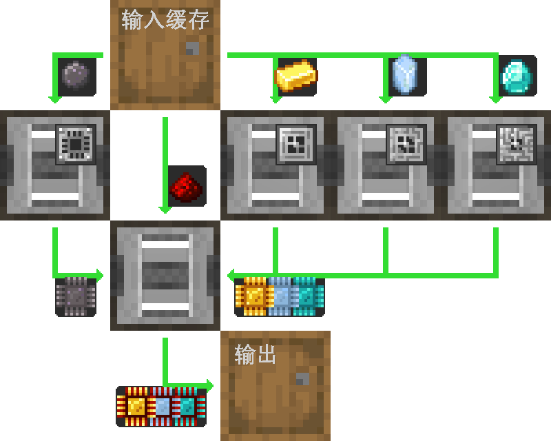

---
navigation:
  parent: example-setups/example-setups-index.md
  title: 处理器自动化生产
  icon: inscriber
---

# 处理器的自动化生产

自动化生产[处理器](../items-blocks-machines/processors.md)有多种方式，以下是其中一种实现方案。

此通用布局适用于任何类型的物品物流管道/导管/传送带（名称因模组而异），只要支持过滤功能即可使用。

以下将详细说明如何仅使用AE2的["管道"子网](pipe-subnet.md)实现该流程。

注意：由于使用了<ItemLink id="pattern_provider" />，本方案旨在集成到[自动合成系统](../ae2-mechanics/autocrafting.md)中。若只需独立自动化生产处理器，可将样板供应器替换为存储容器，并直接将材料放入上层容器。

本方案兼容旧版AE2，因为即使<ItemLink id="inscriber" />有面限制，管道子网仍能正确插入和提取物品。

<GameScene zoom="4" interactive={true}>
  <ImportStructure src="../assets/assemblies/processor_automation.snbt" />

  <BoxAnnotation color="#dddddd" min="5 1 0" max="6 2 1" thickness=".05">
        (1) ME样板供应器：保持默认配置，并载入相关处理样板。

        <Row>
            
            
            
        </Row>
  </BoxAnnotation>

  <BoxAnnotation color="#dddddd" min="4.7 2 0" max="5 3 1" thickness=".05">
        (2) 存储总线#1：保持默认配置。
  </BoxAnnotation>

  <BoxAnnotation color="#dddddd" min="4 1 0" max="4.3 2 1" thickness=".05">
        (3) ME输出总线#1：过滤硅，安装2个加速卡
        <Row><ItemImage id="silicon" scale="2" /> <ItemImage id="speed_card" scale="2" /></Row>
  </BoxAnnotation>

  <BoxAnnotation color="#dddddd" min="4 4 0" max="4.3 3 1" thickness=".05">
        (4) ME输出总线#2：过滤金锭，安装2个加速卡
        <Row><ItemImage id="minecraft:gold_ingot" scale="2" /> <ItemImage id="speed_card" scale="2" /></Row>
  </BoxAnnotation>

  <BoxAnnotation color="#dddddd" min="4 5 0" max="4.3 4 1" thickness=".05">
        (5) ME输出总线#3：过滤赛特斯石英水晶，安装2个加速卡
        <Row><ItemImage id="certus_quartz_crystal" scale="2" /> <ItemImage id="speed_card" scale="2" /></Row>
  </BoxAnnotation>

  <BoxAnnotation color="#dddddd" min="4 6 0" max="4.3 5 1" thickness=".05">
        (6) ME输出总线#4：过滤钻石，安装2个加速卡
        <Row><ItemImage id="minecraft:diamond" scale="2" /> <ItemImage id="speed_card" scale="2" /></Row>
  </BoxAnnotation>

  <BoxAnnotation color="#dddddd" min="2.3 3 0" max="2 2 1" thickness=".05">
        (7) ME输出总线#5：过滤红石粉，安装2个加速卡
        <Row><ItemImage id="minecraft:redstone" scale="2" /> <ItemImage id="speed_card" scale="2" /></Row>
  </BoxAnnotation>

  <BoxAnnotation color="#dddddd" min="4 1 0" max="3 2 1" thickness=".05">
        (8) 压印器#1：默认配置，安装硅压印模板和4个加速卡
        <Row><ItemImage id="silicon_press" scale="2" /> <ItemImage id="speed_card" scale="2" /></Row>
  </BoxAnnotation>

  <BoxAnnotation color="#dddddd" min="4 3 0" max="3 4 1" thickness=".05">
        (9) 压印器#2：默认配置，安装逻辑压印模板和4个加速卡
        <Row><ItemImage id="logic_processor_press" scale="2" /> <ItemImage id="speed_card" scale="2" /></Row>
  </BoxAnnotation>

  <BoxAnnotation color="#dddddd" min="4 4 0" max="3 5 1" thickness=".05">
        (10) 压印器#3：默认配置，安装运算压印模板和4个加速卡
        <Row><ItemImage id="calculation_processor_press" scale="2" /> <ItemImage id="speed_card" scale="2" /></Row>
  </BoxAnnotation>

  <BoxAnnotation color="#dddddd" min="4 5 0" max="3 6 1" thickness=".05">
        (11) 压印器#4：默认配置，安装工程压印模板和4个加速卡
        <Row><ItemImage id="engineering_processor_press" scale="2" /> <ItemImage id="speed_card" scale="2" /></Row>
  </BoxAnnotation>

  <BoxAnnotation color="#dddddd" min="2 2 0" max="1 3 1" thickness=".05">
        (12) 压印器#5：默认配置，安装4个加速卡
        <ItemImage id="speed_card" scale="2" />
  </BoxAnnotation>

  <BoxAnnotation color="#dddddd" min="2.7 2 0" max="3 1 1" thickness=".05">
        (13) ME输入总线#1：默认配置，安装2个加速卡
        <ItemImage id="speed_card" scale="2" />
  </BoxAnnotation>

  <BoxAnnotation color="#dddddd" min="2.7 4 0" max="3 3 1" thickness=".05">
        (14) ME输入总线#2：默认配置，安装2个加速卡
        <ItemImage id="speed_card" scale="2" />
  </BoxAnnotation>

  <BoxAnnotation color="#dddddd" min="2.7 5 0" max="3 4 1" thickness=".05">
        (15) ME输入总线#3：默认配置，安装2个加速卡
        <ItemImage id="speed_card" scale="2" />
  </BoxAnnotation>

  <BoxAnnotation color="#dddddd" min="2.7 6 0" max="3 5 1" thickness=".05">
        (16) ME输入总线#4：默认配置，安装2个加速卡
        <ItemImage id="speed_card" scale="2" />
  </BoxAnnotation>

  <BoxAnnotation color="#dddddd" min="2 3 0" max="1 3.3 1" thickness=".05">
        (17) 存储总线#2：默认配置。
  </BoxAnnotation>

  <BoxAnnotation color="#dddddd" min="2 1.7 0" max="1 2 1" thickness=".05">
        (18) 存储总线#3：默认配置。
  </BoxAnnotation>

  <BoxAnnotation color="#dddddd" min="1 2 0" max="0.7 3 1" thickness=".05">
        (19) ME输入总线#5：默认配置，安装2个加速卡
        <ItemImage id="speed_card" scale="2" />
  </BoxAnnotation>

  <BoxAnnotation color="#dddddd" min="5 0.7 0" max="6 1 1" thickness=".05">
        (20) 存储总线#4：默认配置。
  </BoxAnnotation>

<BoxAnnotation color="#dddddd" min="3.3 2.7 0.3" max="3.7 3 0.7" thickness=".05">
        石英纤维可为所有3台压印器供电，因为压印器可传导能量
  </BoxAnnotation>

<DiamondAnnotation pos="7 1.5 0.5" color="#00ff00">
        连接主网络
    </DiamondAnnotation>

  <IsometricCamera yaw="185" pitch="5" />
</GameScene>

## 配置说明

* <ItemLink id="pattern_provider" /> (1) 保持默认配置，并载入相关<ItemLink id="processing_pattern" />

  
  
  

* 所有<ItemLink id="storage_bus" /> (2,17,18,20) 保持默认配置
* <ItemLink id="export_bus" /> (3-7) 过滤对应材料，安装2个<ItemLink id="speed_card" />
    <Row>
      <ItemImage id="silicon" scale="2" />
      <ItemImage id="minecraft:gold_ingot" scale="2" />
      <ItemImage id="certus_quartz_crystal" scale="2" />
      <ItemImage id="minecraft:diamond" scale="2" />
      <ItemImage id="minecraft:redstone" scale="2" />
    </Row>
* <ItemLink id="import_bus" /> (13-16,19) 保持默认配置，安装2个<ItemLink id="speed_card" />
* <ItemLink id="inscriber" /> 保持默认配置，安装对应[压印模板](../items-blocks-machines/presses.md)和4个<ItemLink id="speed_card" />
   <Row>
     <ItemImage id="silicon_press" scale="2" />
     <ItemImage id="logic_processor_press" scale="2" />
     <ItemImage id="calculation_processor_press" scale="2" />
     <ItemImage id="engineering_processor_press" scale="2" />
   </Row>

## 工作原理

1. <ItemLink id="pattern_provider" />将材料推入存储容器
2. 第一个[管道子网](pipe-subnet.md)（橙色）从容器中提取硅、红石粉及相关处理器材料（金锭/赛特斯石英水晶/钻石）到对应<ItemLink id="inscriber" />
3. 前四台<ItemLink id="inscriber" />分别生产<ItemLink id="printed_silicon" />、<ItemLink id="printed_logic_processor" />、<ItemLink id="printed_calculation_processor" />或<ItemLink id="printed_engineering_processor" />
4. 第二和第三个[管道子网](pipe-subnet.md)（绿色）将半成品从压印器传输至第五台总装压印器
5. 第五台<ItemLink id="inscriber" />完成[处理器](../items-blocks-machines/processors.md)的组装
6. 第四个[管道子网](pipe-subnet.md)（紫色）将成品送回样板供应器，返回主网络