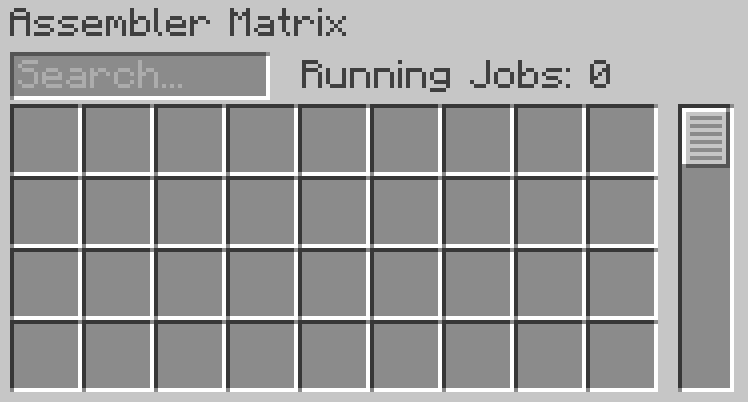

---
navigation:
    parent: epp_intro/epp_intro-index.md
    title: 装配矩阵
    icon: expatternprovider:assembler_matrix_frame
categories:
- 扩展设备
item_ids:
- expatternprovider:assembler_matrix_frame
- expatternprovider:assembler_matrix_wall
- expatternprovider:assembler_matrix_glass
- expatternprovider:assembler_matrix_pattern
- expatternprovider:assembler_matrix_crafter
- expatternprovider:assembler_matrix_speed
---

# 装配矩阵

<Row>
<BlockImage id="expatternprovider:assembler_matrix_frame" p:formed="true" p:powered="true" scale="5"></BlockImage>
<BlockImage id="expatternprovider:assembler_matrix_wall" scale="5"></BlockImage>
<BlockImage id="expatternprovider:assembler_matrix_glass" scale="5"></BlockImage>
</Row>
<Row>
<BlockImage id="expatternprovider:assembler_matrix_pattern" scale="5"></BlockImage>
<BlockImage id="expatternprovider:assembler_matrix_crafter" scale="5"></BlockImage>
<BlockImage id="expatternprovider:assembler_matrix_speed" scale="5"></BlockImage>
</Row>

装配矩阵是一个多方块结构，是<ItemLink id="ae2:molecular_assembler" />（分子装配室）和<ItemLink id="ae2:pattern_provider" />（样板供应器）的结合体。它可以同时运行多个合成工作（当你的ME网络中有足够的<ItemLink id="ae2:crafting_accelerator" />时），并为你节省频道资源。

## 结构组成

<GameScene zoom="3" background="transparent" interactive={true}>
  <ImportStructure src="../structure/assembler_matrix.snbt"></ImportStructure>
</GameScene>

该结构是一个长方体，各边长度介于3至7之间：
- 边缘由装配矩阵框架构成
- 表面由装配矩阵墙壁/玻璃构成
- 内部由装配矩阵样板/合成/速度核心构成

有效的装配矩阵必须包含至少一个样板核心和合成核心。结构必须完全填充，不能存在空心区域。当装配矩阵正确形成并通电时，框架上的线条会变为蓝色。

## 矩阵核心

包含三种不同类型的核心：

- **装配矩阵样板核心**  
装配矩阵仅从其样板核心获取样板。每个样板核心提供36个样板槽位。

- **装配矩阵合成核心**  
装配矩阵会将接收到的合成任务分配给其合成核心。每个合成核心可同时处理8个合成任务。

- **装配矩阵速度核心**  
该核心相当于装配矩阵的<ItemLink id="ae2:speed_card" />（速度卡）。安装5个速度核心可使装配矩阵达到全速运行。超过5个速度核心不会带来额外加速。

## 操作界面

右键点击已形成并在线运行的装配矩阵可打开其操作界面：

在此界面可以放置或搜索样板，并查看当前运行的合成任务数量。