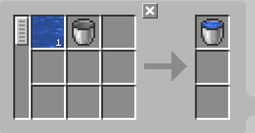
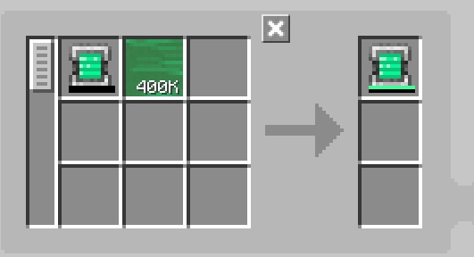

---
navigation:
    parent: epp_intro/epp_intro-index.md
    title: ME装罐机
    icon: expatternprovider:caner
categories:
- extended devices
item_ids:
- expatternprovider:caner
---

# ME装罐机

<BlockImage id="expatternprovider:caner" scale="8"></BlockImage>

ME装罐机是能够进行流体、Mekanism气体、Botania魔力乃至能量"装罐"操作的设备。

第一槽位用于填充物，第二槽位用于被填充容器。

需要消耗能量运行，每次操作消耗80 AE。

默认仅支持流体装罐，需安装对应扩展模组以支持其他类型：

### 支持扩展：
- Applied Flux（应用通量）
- Applied Mekanistics（应用能源：通用机械附属）
- Applied Botanics Addon（应用能源：植物魔法附属）

## 自动合成应用

仅顶部和底部可接收能量并与网络连接。

<GameScene zoom="6" background="transparent">
  <ImportStructure src="../structure/caner_example.snbt"></ImportStructure>
</GameScene>

ME装罐机的基础配置。当从<ItemLink id="ae2:pattern_provider" />接收原料后，会自动弹出已完成装罐的物品。

<GameScene zoom="6" background="transparent">
  <ImportStructure src="../structure/caner_auto.snbt"></ImportStructure>
</GameScene>

样板必须仅包含待填充物和待填充容器。示例如下：

装填水桶：

充能能量片（需安装Applied Flux）：

## 排空模式

ME装罐机在排空模式下可抽取容器中的物质。需在样板中调换输入输出顺序。