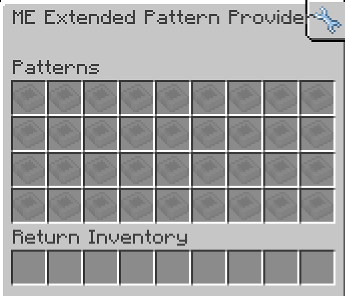

---
navigation:
    parent: epp_intro/epp_intro-index.md
    title: ME扩展样板供应器
    icon: expatternprovider:ex_pattern_provider
categories:
- extended devices
item_ids:
- expatternprovider:ex_pattern_provider
- expatternprovider:ex_pattern_provider_part
---

# ME扩展样板供应器

<Row gap="20">
<BlockImage id="expatternprovider:ex_pattern_provider" scale="8"></BlockImage>
<BlockImage id="expatternprovider:ex_pattern_provider" p:push_direction="up" scale="8"></BlockImage>
<GameScene zoom="8" background="transparent">
  <ImportStructure src="../structure/cable_ex_pattern_provider.snbt"></ImportStructure>
</GameScene>
</Row>

ME扩展样板供应器是<ItemLink id="ae2:pattern_provider" />的升级版本，具有扩展的样板存储容量。

*当您能将所有样板集中存储时，何必需要子网络？*

