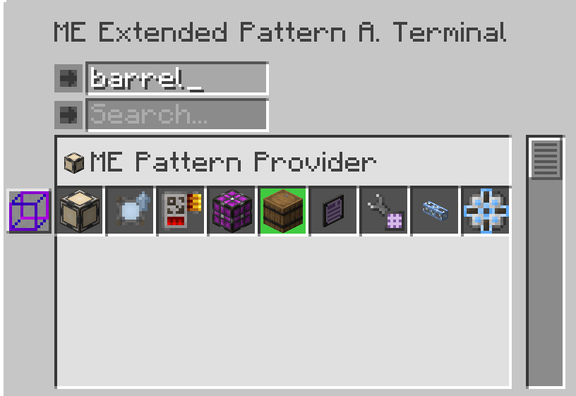
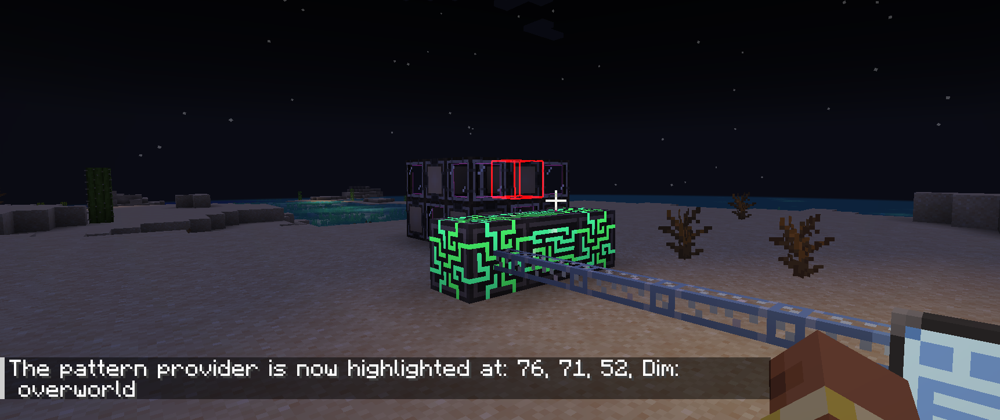

---
navigation:
    parent: epp_intro/epp_intro-index.md
    title: ME扩展样板管理终端
    icon: expatternprovider:ex_pattern_access_part
categories:
- extended devices
item_ids:
- expatternprovider:ex_pattern_access_part
- expatternprovider:wireless_ex_pat
---

# ME扩展样板管理终端

相比<ItemLink id="ae2:pattern_access_terminal" />，本终端提供3项增强功能：

<Row gap="20">
<GameScene zoom="6" background="transparent">
<ImportStructure src="../structure/cable_ex_pattern_terminal.snbt"></ImportStructure>
<IsometricCamera yaw="180"></IsometricCamera>
</GameScene>
<ItemImage id="expatternprovider:wireless_ex_pat" scale="4"></ItemImage>
</Row>

## 增强型样板搜索

支持通过输入/输出原料名称进行样板检索。

## 样板高亮系统

当多个样板以组形式显示时，终端可自动高亮匹配项。

## 实体高亮定位

大规模合成时快速定位问题样板供应器，终端可对世界中的目标设备进行实体高亮。

