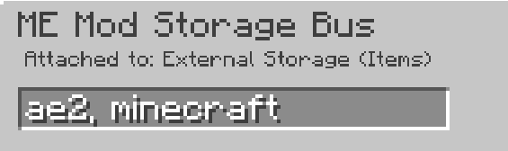

---
navigation:
    parent: epp_intro/epp_intro-index.md
    title: ME模组存储总线
    icon: expatternprovider:mod_storage_bus
categories:
- extended devices
item_ids:
- expatternprovider:mod_storage_bus
---

# ME模组存储总线

<GameScene zoom="8" background="transparent">
  <ImportStructure src="../structure/cable_mod_storage_bus.snbt"></ImportStructure>
</GameScene>

ME模组存储总线是<ItemLink id="ae2:storage_bus" />的强化版本，具备以下特性：
- 支持通过模组名称或模组ID进行存储过滤
- 多个模组ID可用逗号分隔实现复合过滤

