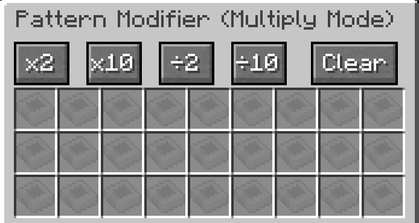
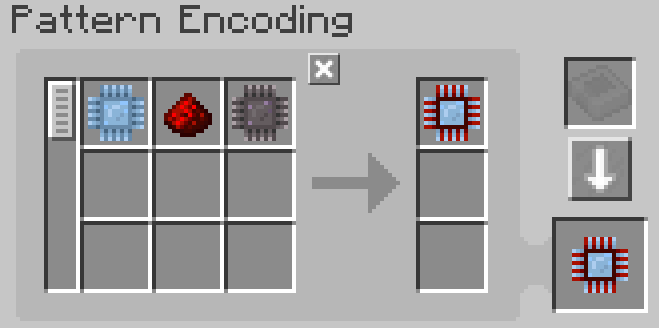
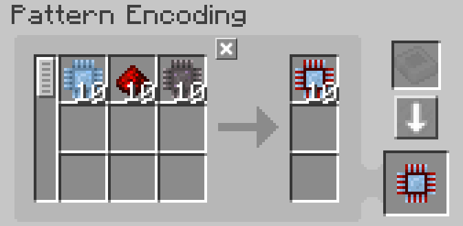
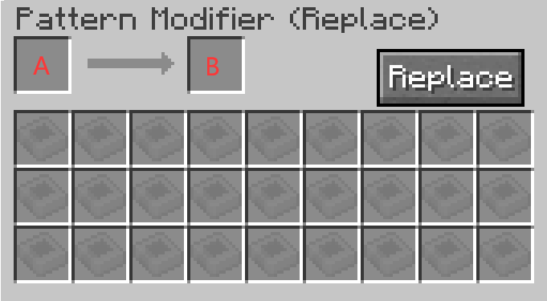
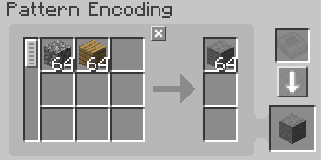
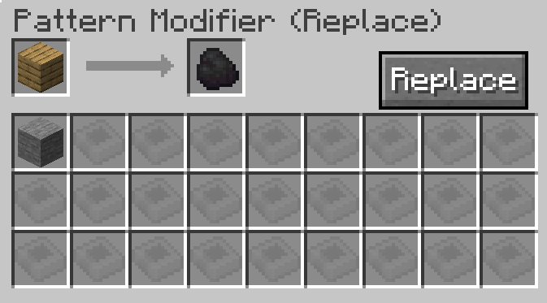
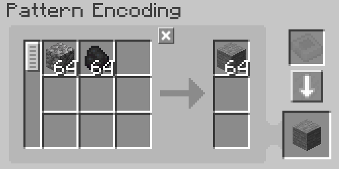
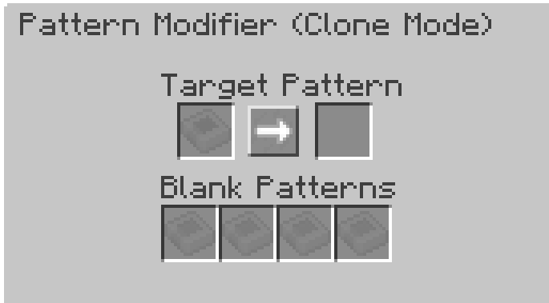

---
navigation:
    parent: epp_intro/epp_intro-index.md
    title: 样板修改器
    icon: expatternprovider:pattern_modifier
categories:
- extended items
item_ids:
- expatternprovider:pattern_modifier
---

# 样板修改器

批量修改AE2样板的专业工具

<ItemImage id="expatternprovider:pattern_modifier" scale="4"></ItemImage>

右键点击开启操作界面

## 乘数模式

通过点击对应按钮，可将样板输入输出量进行倍率调整：

原始样板：

10倍处理后：

点击"清除"按钮可将所有样板内容重置为空白状态

### 注意事项

- 除法操作仅在数值可整除时生效（如输入量为3时无法执行÷2操作）
- 单原料最大调整上限为999,999（通过乘法按钮无法突破此限制）

## 替换模式

精准替换样板中的指定输入/输出原料：

- 槽位A：待替换原料
- 槽位B：替换目标原料

示例：将木板替换为煤炭

点击"替换"按钮执行操作：

## 复制模式

完整克隆现有样板配置：

