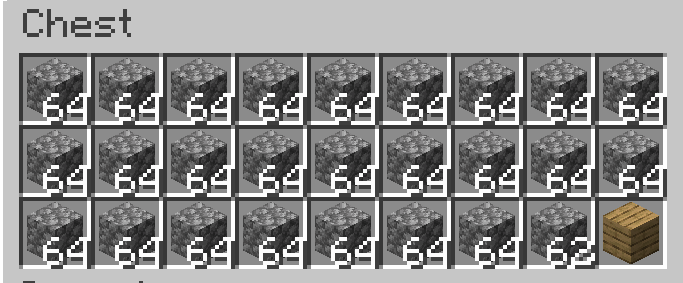

---
navigation:
    parent: epp_intro/epp_intro-index.md
    title: ME精确输出总线
    icon: expatternprovider:precise_export_bus
categories:
- extended devices
item_ids:
- expatternprovider:precise_export_bus
---

# ME精确输出总线

<GameScene zoom="8" background="transparent">
  <ImportStructure src="../structure/cable_precise_export_bus.snbt"></ImportStructure>
</GameScene>

ME精确输出总线具备精准物流控制功能：
- 按指定数量导出物品/流体
- 仅当目标容器可完整接收指定数量时执行导出操作

## 工作示例

配置导出3个圆石时：
- 当网络存储量＜3时自动暂停操作

容器剩余容量不足时：
- 图示箱子仅可容纳2个圆石
- 总线自动停止当前导出周期