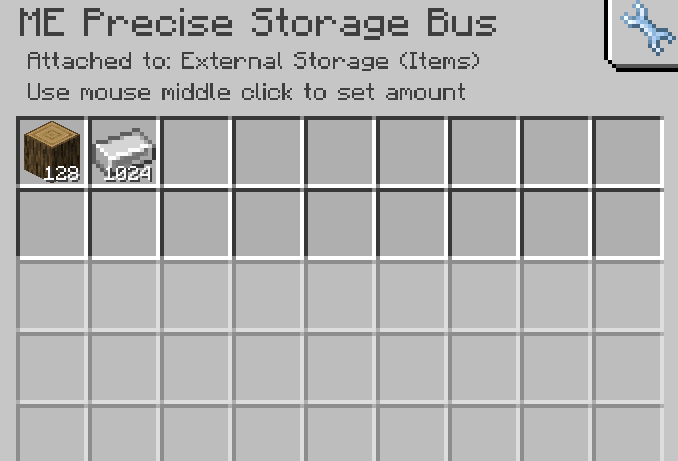

---
navigation:
    parent: epp_intro/epp_intro-index.md
    title: ME精确存储总线
    icon: expatternprovider:precise_storage_bus
categories:
- extended devices
item_ids:
- expatternprovider:precise_storage_bus
---

# ME精确存储总线

<GameScene zoom="8" background="transparent">
  <ImportStructure src="../structure/cable_precise_storage_bus.snbt"></ImportStructure>
</GameScene>

ME精确存储总线是<ItemLink id="ae2:storage_bus" />的增强版本，具备精准存储控制功能：
- 支持通过数值过滤设置存储阈值
- 插入物品时严格遵循数量限制机制

## 工作原理
1. 当连接容器时，总线将扫描其存储内容
2. 用户可在界面设置具体数值上限（如保持某物品存量≤64）
3. 系统仅允许插入物品直至达到预设阈值
4. 超量物品将被网络自动拦截

## 应用场景
- 精确控制自动化产线的原料缓冲量
- 防止ME网络中的物品过量堆积
- 配合合成系统实现精准物料配给